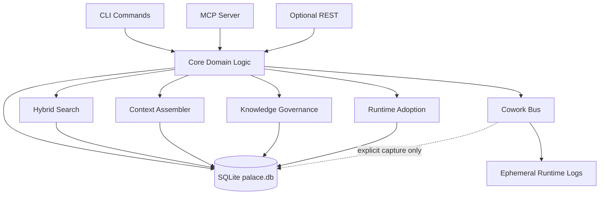

# 第 3 章：整体架构

> **本章定位**：从系统层面解释 mempal 的模块边界、数据路径和 runtime surface。

mempal 是单二进制 Rust 程序。它通过 CLI 服务人类操作者，通过 MCP 服务 agent runtime，通过 SQLite 保存本地持久记忆。

整体结构如下。

这张图有三个核心含义。

第一，SQLite `palace.db` 是持久化中心。mempal 没有把 knowledge cards、runtime adoption events 或 triples 拆到外部服务里。这样做保持了本地优先、单文件备份和事务一致性。

第二，CLI 和 MCP 是两个入口，不是两套系统。人类用 CLI 做安装、诊断、维护、发布检查和显式 lifecycle 操作；agent 用 MCP 在 runtime 里 search、context、brief、cowork、phase3。两者应该共享核心逻辑，否则人类看到的状态和 agent 看到的状态会分裂。

第三，cowork runtime log 与 durable memory 分离。多 agent 通信需要 inbox、events、deliveries、sessions、handoff，但这些运行时协调信息不能自动污染 `palace.db`。只有 explicit capture 才会把 handoff summary 写入 evidence drawer。

## 模块分层

最底层是 SQLite。当前 schema 版本是 v9，核心数据包括 drawers、vectors、triples、knowledge cards、knowledge evidence links、knowledge events、runtime adoption events 等。

`drawers` 保存原始记忆。它们可以是普通 evidence，也可以带 typed metadata：memory kind、knowledge tier、status、domain、field、anchor。向量存在独立表里，原文不被 embedding 替代。

Search 层负责找回。它组合 BM25、向量检索和 RRF，返回带引用的结果。P7 以后，MCP search 结果还包含 entities、topics、flags、emotions、importance stars 等结构化 signals。

Context 层负责组装。它不是 search 的同义词。`mempal context` / `mempal_context` 会按 tier 和 anchor 顺序组织内容（组装顺序的定义见第 5 章 §Runtime 组装顺序），用来指导 agent 做判断、选 workflow、选 skill、选工具。

Knowledge 层负责治理。Stage-1 typed drawers 支持 distill、gate、promote、demote、publish anchor。Phase-2 knowledge cards 增加 card、evidence link、event 三类结构，使知识生命周期更清晰。

Phase-3 是 runtime adoption evidence。它记录 context、card、evaluator、research 等 runtime surface 是否被使用、接受、拒绝、miss、rollback。它不直接改默认值，而是为 readiness、default proposal、rollback control 提供证据。

为什么 Phase-3 是独立子系统，而不是 knowledge card 的一个字段？因为它记录的是“观察”，不是“判断”。如果把 adoption 计数直接挂到 card 上、让 card 的状态随使用反馈自动变化，就等于让 runtime 信号绕过 gate 改变 knowledge state——这正是治理边界要禁止的事（详见第 9 章）。把 observation channel 与 governance state 物理隔开，才能保证“被用了多少次”永远只是证据，要不要因此改变默认行为仍然要走显式 readiness 和 control。

Cowork 层负责多 agent 协作。它有两条线：早期 Claude/Codex inbox push，以及后来的 concrete agent bus。bus 支持 register、send、broadcast、channels、delivery ack、heartbeat、tmux peek、session、handoff、capture。默认都是 runtime 协作，只有 explicit capture 才进入 durable memory。

MCP 是 agent 的主入口。当前 MCP 暴露 `mempal_search`、`mempal_context`、`mempal_brief`、`mempal_phase3`、`mempal_cowork_bus` 等工具。ServerInfo.instructions 内嵌 MEMORY_PROTOCOL，让 agent 连接后知道如何使用 mempal。

CLI 是 operator 的主入口。安装、诊断、维护、release readiness、manual capture、knowledge lifecycle，都可以通过 CLI 完成。CLI 和 MCP 共享核心逻辑，避免 agent 与人类看到两套行为。

## 五条主要数据路径

第一条路径是 ingest：外部文本、对话、research output 或 explicit capture 进入 mempal，经格式识别、归一化、分块、embedding、metadata 写入 drawers 和向量索引。P9-B 的 per-source lock 保护并发 ingest 同一 source 时不发生 TOCTOU race；normalize version 让旧数据可以被 stale reindex。

第二条路径是 search：query 经过路由、BM25、vector retrieval、RRF merge，最后返回带 citations 的 result。search 的职责是找证据，不负责把 evidence 变成 runtime 指导。

第三条路径是 context：query 进入 context assembler，系统按 tier 和 anchor 选择 typed knowledge，再按预算输出 context pack。context 的职责是给 agent 当前任务的操作性指导。

第四条路径是 knowledge lifecycle：evidence refs 通过 distill 产生 candidate；gate 评估是否满足 promotion 条件；promote/demote/publish-anchor 改变 knowledge 或 card 状态，并写入审计事件。

第五条路径是 cowork：agent 注册、发送消息、ack、heartbeat、tmux peek、session handoff。默认它是 runtime 协作流；只有 `cowork-capture --execute` 这类显式操作才会进入 durable evidence。

## REST 的位置

REST API 是 feature-gated 补充入口，不是当前书稿主线。mempal 的默认操作面是 CLI 和 MCP：CLI 服务人类 operator，MCP 服务 agent runtime。REST 更适合外部系统集成，但不应该影响本地单二进制、单 SQLite 文件的基本产品形态。

## 架构边界

mempal 的架构不是一个“万能 agent 平台”。它不调度模型，不替代 agent runtime，也不把 skill system 收进自己内部。它提供的是 memory、context、governance、measurement 和 cowork substrate。agent 仍然负责推理和执行；mempal 负责让这些推理和执行有历史、有出处、有反馈。

## 本章来源

本章依据 `AGENTS.md` 的 workspace/MCP inventory、`docs/specs/2026-04-08-mempal-design.md` 的初始架构、`docs/MIND-MODEL-DESIGN.md` 的 mind-model runtime 边界，以及 `docs/COWORK-RUNBOOK.md`、`docs/MAINTENANCE-RUNBOOK.md` 的操作流程整理。
