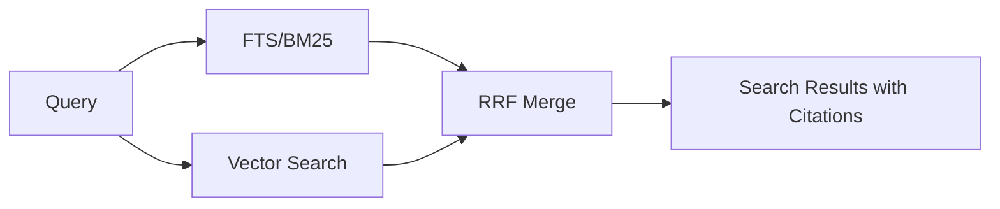

# 第 4 章：存储、检索与引用

> **本章定位**：解释 mempal 如何保存 raw evidence、如何检索、以及为什么 citation 是硬约束。

mempal 的存储原则是：原文永远保留，索引只是辅助。

每条记忆进入 `drawers`。drawer 保存 content、source、wing、room、importance、chunk index、typed metadata 等字段。内容不被总结覆盖，也不被向量替代。这样做的好处是，当 agent 回答一个历史决策时，可以回到原始证据，而不是引用某次不可靠的摘要。

## raw drawer 是引用根

drawer 是 mempal 里最基础的 durable memory unit。无论后续 knowledge card、brief、context pack 如何组织信息，它们都应该能追回 drawer。原因很简单：agent 对项目事实的回答如果没有 source，就只是模型生成；有 source，才有审计和纠错的入口。

raw drawer 也保护了未来演进。summary 不总是完整，embedding 模型也会迭代，但原始 evidence 只要还在，就可以重新 normalize、重新 embed、重新 distill。mempal 因此把 compression、AAAK、brief、card 都放在 raw storage 之上，而不是替代 raw storage。

向量索引也是辅助结构。embedding 可以帮助语义召回，但不是事实本身。事实仍然在 `content`、`source_file`、`drawer_id` 和相关 metadata 中。

检索走混合路径。



BM25 擅长关键词。向量擅长语义近似。RRF 用来融合两边结果，避免单一路径主导。最终结果必须包含 `source_file`、`drawer_id`、tunnel hints 等引用信息。

## 为什么需要混合检索

coding agent 查历史时，query 经常有两种形态。一种是精确词，例如 spec 名、P 编号、命令名、tool 名、schema 字段；另一种是语义问题，例如“为什么 card context 没有默认开”。只靠 BM25 会漏掉语义相近但词不一致的记录；只靠向量会在精确词上不稳定。mempal 用 BM25 + vector + RRF，把两类召回合并。

RRF 的价值在于保守融合。它不要求两个检索器输出同一尺度的 score，而是按排名融合，降低单一路径误导排序的风险。具体实现是一个固定常数 `RRF_K = 60` 的倒数秩公式：

```rust
// src/search/mod.rs：RRF score = sum(1 / (k + rank)) across both lists
const RRF_K: f64 = 60.0;
let score = 1.0 / (RRF_K + rank as f64 + 1.0);
```

这里有两个值得注意的设计含义。第一，`RRF_K` 是固定常数而非可调权重——mempal 故意不让调用方按 query 调节两路检索的相对权重，因为按排名融合本身已经对 score 尺度差异鲁棒，再引入可调权重只会增加难以解释的排序行为。第二，当一路检索为空（例如 query 没有任何 BM25 命中）时，代码直接退回另一路结果而不强行融合，避免空列表稀释排序。

### 什么时候 hybrid 是 overkill

混合检索不是免费的。每次 query 要同时跑 FTS 和向量两路检索，再做一次 RRF 合并；向量那一路还要先把 query embedding 算出来。也就是说，hybrid 的延迟和计算量大致是单路检索的两倍，外加一次 embedding 推理。

在两类场景里这笔开销不划算。一是记忆库很小、关键词高度稳定（例如只存结构化的 spec 名、命令名、P 编号），这时纯 BM25 已经能稳定命中，向量那一路几乎不贡献新结果。二是查询本身就是精确标识符（“P54 是什么”），语义召回反而可能引入噪声。mempal 默认走 hybrid，是因为 coding agent 的历史查询里精确词和语义问题混杂，单路都不稳；但如果你的使用场景明显偏向其中一种，应该意识到 hybrid 的第二路只是在付出延迟而没换来召回。这不是要你关掉它——而是说明默认值服务的是“混杂查询”这个前提，前提变了，性价比也会变。

P11 增加了 chunk neighbors。很多历史记录被切成 chunk 后，单个命中可能缺上下文。`--with-neighbors` 可以返回前后相邻 chunk，但只在受控范围内启用，避免 top_k 过大时爆炸。

P10 引入 explicit tunnels。tunnel 是跨 wing/room 的链接，用来表达“这些记忆虽然不在同一分类下，但应该互相可达”。search result 会合并 passive 和 explicit tunnel hints，帮助 agent 扩展下一轮查询。

P7 给 MCP search 结果补了结构化 signals：

- `entities`
- `topics`
- `flags`
- `emotions`
- `importance_stars`

这些字段来自 AAAK-derived analysis，但 `content` 仍然是 raw text。agent 可以用 signals 做过滤和排序，但不能把它当成原文格式。

## 引用纪律

在 mempal 项目里，agent 回答历史决策、实现细节、bug 成因和架构理由时，应该先使用 mempal search，而不是只靠 repo grep 或当前对话记忆。每条高信号结果都要看 `drawer_id`、`source_file`、signals 和 importance。决策问题优先看 `flags` 里带 `DECISION` 的结果；实现问题优先看 `TECHNICAL`；如果证据不足，应扩大查询范围，而不是猜。

这个纪律看似繁琐，但它解决的是长期信任问题。一个 agent 如果不能说明“这条说法从哪里来”，它就不应该把这条说法当成项目事实。

search 和 context 的边界很重要：

| 能力 | 用途 |
|---|---|
| `mempal_search` | 找证据、查历史、定位 source |
| `mempal_context` | 组装 dao/shu/qi/evidence 指导 agent 行动 |
| `mempal_brief` | 生成 citation-first 的任务简报 |

如果问题是“以前为什么这么做”，先 search。  
如果问题是“我现在该怎么做”，先 context。  
如果问题是“给我一份带出处的简报”，用 brief。

三者在 agent 实际任务中的调用时机和组合方式，详见第 7 章。

## 运维相关机制

存储和检索还需要处理长期运行中的现实问题。

`normalize_version` 让归一化逻辑升级后可以识别 stale drawers。`reindex --stale` 不是功能炫技，而是保证旧 memory 可以跟随新的 normalization rule 重新进入索引。

per-source ingest lock 解决多 agent 同时 ingest 同一 source 的 race。Claude 和 Codex 并发工作时，如果没有锁，重复写入、统计不一致或 source-level TOCTOU 都会污染 memory。

chunk neighbors 解决“命中太碎”的问题；tunnels 解决“相关内容不在同一 wing”的问题；structured signals 解决“结果太多时如何优先处理”的问题。这些机制都不是替代 search，而是在真实 coding-agent 场景中让 search 更可用。

这套设计保证了一个底线：agent 可以推理，但项目事实必须能追到证据。

## 本章来源

本章依据 P7、P9-B、P10、P11 相关 specs，`AGENTS.md` 的 mempal 检索纪律，以及 `docs/specs/2026-04-08-mempal-design.md` 的 raw storage / hybrid search 设计整理。
