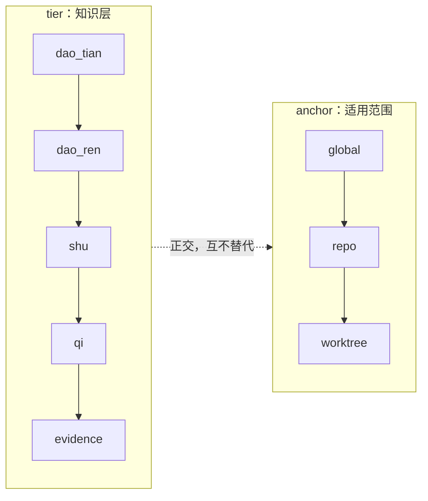

# 第 5 章：心智模型：道、器、术与 evidence

> **本章定位**：解释 mempal 的知识分类如何把原始证据、元知识、方法和工具分开。

mempal 的心智模型来自一个简单分类：道、器、术。

这里的“道”不是玄学。它表示可迁移的规律。不同层次的道有不同边界：

- `dao_tian`：跨领域高层原则，最少、最稳。
- `dao_ren`：领域规律，稳定但有明确边界。

“术”是可复用方法论，直接影响 agent 的 workflow 和 skill 选择。  
“器”是工具能力和工具用法，依赖环境、版本、命令和限制。  
“evidence” 是原始证据，不是知识本身。

这个分类回答的是“这条内容在认知结构里扮演什么角色”。它不回答“这条内容属于哪个项目、哪个 agent、哪个 skill”。这两个问题必须分开，否则系统会把项目局部经验误当成通用规律，或者把工具命令误当成稳定方法论。

| 类型 | 含义 | 默认状态倾向 | 典型用途 |
|---|---|---|---|
| evidence | 原始事实、记录、外部 research、handoff capture | raw | 支撑后续 distill 和验证 |
| dao_tian | 跨领域原则 | canonical 或 demoted | 极少量高层判断 |
| dao_ren | 领域规律 | candidate 或 promoted | 指导领域内判断 |
| shu | 方法论/技巧 | promoted | 影响 workflow/skill trigger |
| qi | 工具能力/用法 | candidate 或 promoted | 指导命令、MCP、CLI、版本使用 |

## 四类 knowledge 的区别

`dao_tian` 是最少、最稳的原则。它应该跨领域成立，例如“证据先于断言”“只有 promotion 没有 demotion 会污染长期记忆”。这类知识默认不能随便 candidate 化；它要么已经 canonical，要么在被反例削弱后 demoted。

`dao_ren` 是领域规律。它比 `dao_tian` 更具体，有 field 边界。例如在 coding-agent memory 领域，“research output 不能直接定义 dao”可以是 `dao_ren`，因为它服务于 mempal 这类系统的治理逻辑。

`dao_tian` 和 `dao_ren` 的边界不是文字游戏，可以用一个操作化的问题来分：**把这条规律移到一个完全不同的领域（交易系统、嵌入式固件、内容审核），它还成立吗？** “证据先于断言”在任何需要可信结论的领域都成立，所以它是 `dao_tian`；“research output 不能直接定义 dao”离开了 memory governance 这个 field 就失去意义，所以它最高只能是 `dao_ren`。换个角度：`dao_tian` 的反例会动摇整套认知方法，`dao_ren` 的反例只会修正某个领域的做法。

这个边界要慎重，是因为误判的代价不对称。把一条 `dao_ren` 错升成 `dao_tian`，等于把一条领域局部规律提升为跨领域原则——它会在 context 组装时以最高优先级注入到所有任务（`dao_tian` 默认排在最前，且 anchor 通常是 global），于是不相关领域的 agent 也会被这条本不适用的规律带偏。反过来，把 `dao_tian` 误降为 `dao_ren` 的代价小得多：最多是这条原则少出现在几个领域，不会污染判断。正因如此，gate 对 `dao_tian → canonical` 的门槛远高于其它 tier（详见第 6 章 §Gate 与 authority），而 `dao_tian` 默认不允许随意 candidate 化。

`shu` 是方法论。它直接影响怎么做事，例如“实现新 P 前先写 spec 和 plan，再实现，再验收，再更新 inventory”。`shu` 不一定是永恒规律，但它应该足够可复用，能影响 workflow 或 skill selection。

`qi` 是工具能力和工具用法。它描述命令、MCP tool、参数、环境版本和限制。例如 `mempal phase3 adoption capture --execute` 的语义、`mempal_cowork_bus` 的 action 集合，都属于 `qi`。`qi` 最依赖版本和环境，因此最需要 stale/rollback 意识。

evidence 与这四类不同。evidence 可以冲突，可以杂乱，可以保留原始上下文。它的职责是保存“看到了什么”，而不是直接声明“系统应该相信什么”。

## 正交坐标

这个分类独立于项目记忆、agent 行为记忆、skill 记忆。它是通用元知识层。一个项目可以有自己的 evidence，一个 agent 可以有自己的 diary，一个 skill 可以有自己的使用反馈；但道器术描述的是更通用的判断结构。

更完整地说，一条 memory 至少有几组坐标：

| 坐标 | 问题 | 示例 |
|---|---|---|
| domain | 服务于谁 | project、agent、skill、global |
| tier | 是什么知识层 | dao_tian、dao_ren、shu、qi |
| field | 属于哪个领域 | software-engineering、memory-governance、tooling |
| provenance | 从哪里来 | runtime、research、human |
| anchor | 适用范围 | worktree、repo、global |

这些坐标不能互相替代。一个 debugging checklist 可能是 `domain=skill`、`tier=shu`、`field=software-engineering`；一个 CLI 参数说明可能是 `domain=project`、`tier=qi`、`anchor=repo`；一个 branch-local 实验结论可能只能放在 `anchor=worktree`。

tier 和 anchor 是两条正交的阶梯：tier 决定“这是哪一层知识”，anchor 决定“它适用到多大范围”。一条 memory 在这两条阶梯上各占一个位置，二者独立移动。



升 tier（evidence → candidate → promoted）和发布 anchor（worktree → repo → global）是两件独立的事：一个 `qi` 可以在 worktree 内有效却不必发布到 repo；一个 repo 级 `shu` 也未必有资格成为 global `dao_tian`。

## Anchor：worktree、repo、global

anchor 决定知识适用范围。

| Anchor | 含义 |
|---|---|
| `worktree` | 当前 worktree，适合跨分支实验记忆 |
| `repo` | 仓库级规律，适合主线项目知识 |
| `global` | 跨项目知识，必须非常稳定 |

mempal 使用 worktree path 作为项目锚点，而不是单纯 repo path。这让同一仓库不同分支实验可以保留各自记忆。

repo-only 会让分支实验互相污染；worktree-only 又会让稳定项目知识碎片化。mempal 的策略是双层：branch-local 观察先留在 worktree，被验证后的项目知识可以 publish 到 repo，真正跨项目的原则才进入 global。

因此，tier promotion 和 anchor publication 是两件事。一个 `qi` 可以在 worktree 内有效，但不该发布到 repo；一个 `shu` 可以是 repo-level 方法论，但还没有资格成为 global `dao_tian`。

## Runtime 组装顺序

context 组装时，mempal 默认按以下顺序：

```text
dao_tian -> dao_ren -> shu -> qi -> evidence
worktree -> repo -> global
```

这不是说高层原则永远更重要，而是说 agent 在行动前应该先看到稳定判断，再看领域规律、方法、工具，最后看原始证据。`dao_tian` 默认最多注入一条，避免高层原则污染具体任务。

这个顺序也解释了为什么 context 不是 search。search 面向找材料，context 面向构造操作性指导。context 需要知道哪些内容是原则、哪些是领域规律、哪些是方法、哪些是工具，才能合理排序和预算。

## research-rs 的位置

research-rs 或其他外部工具不拥有“道”的定义权。research 输出只能进入 evidence，或者成为 evidence-backed candidate insight。是否提升为 dao，必须经过 mempal 的 lifecycle。

这点是设计边界，不是实现细节。外部 research 可以很强，可以生成 wiki、sources、findings、candidate insights，但它仍然是 `qi`：一个产生 evidence 的工具。`dao` 属于 memory layer，因为只有 memory layer 负责 provenance、gate、demotion、anchor 和 runtime adoption feedback。

如果让 research report 直接定义 `dao`，系统会跳过最关键的学习步骤：从 evidence 到 candidate，再从 candidate 到 promoted/canonical。mempal 故意不允许这条捷径。

## 判断一条内容放哪里

判断时可以用四个问题：

| 问题 | 倾向 |
|---|---|
| 它只是一次观察、记录、日志、research finding 吗？ | evidence |
| 它是某个工具、命令、MCP action、版本行为吗？ | qi |
| 它是一套可复用做法、流程、检查清单吗？ | shu |
| 它是在某个领域稳定成立的规律吗？ | dao_ren |
| 它是否跨领域、极少、极稳，并能指导判断？ | dao_tian |

这个分类不要求一次写入就完美。mempal 允许从 evidence 开始，经过 distill 和 gate 再提升。关键是不要一开始就把未验证的总结放到高层 tier。

## 本章来源

本章依据 `docs/MIND-MODEL-DESIGN.md`、P12-P28 mind-model bootstrap specs、P49 research ingestion policy，以及 `docs/MIND-MODEL-IMPLEMENTATION-ARTICLE.zh-CN.md` 整理。
