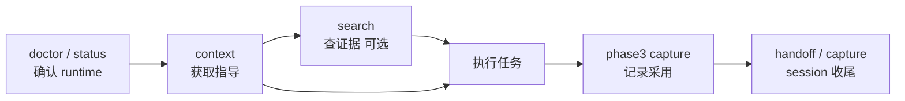

# 第 7 章：Runtime Context 与 agent 使用方式

> **本章定位**：说明 agent 在真实任务中应该如何使用 search、context、brief 和 adoption evidence。

agent 使用 mempal，不应该只在“想起来搜索一下”时才调用。更好的方式是把 mempal 放到任务开始、决策前、收尾时三个位置。

任务开始时，agent 需要知道当前项目有哪些稳定约束、当前 worktree 是否有特殊上下文、哪些工具或 workflow 更可能相关。这不是 search 的问题，而是 context assembly 的问题。

任务开始时，先拿 context：

```bash
mempal context "当前任务" --include-cards --format plain
```

`context` 返回的是指导性上下文。它按 `dao_tian -> dao_ren -> shu -> qi -> evidence`（再按 `worktree -> repo -> global`）分层，帮助 agent 判断当前任务应该遵循哪些规律、方法和工具约束。这套组装顺序的语义在第 5 章 §Runtime 组装顺序定义，这里只说明 agent 怎么用。

`dao_tian` 默认最多注入一条，避免抽象原则淹没具体工作。cards 仍然是 opt-in 或受 default gate 控制，因为 card-aware context 是 runtime trust boundary。

需要带出处简报时，用 brief：

```bash
mempal brief "当前任务" --format json
```

`brief` 是 deterministic citation-first brief。它不调用 LLM，不写数据库。输出包含 summary、key facts、evidence、cards、uncertainty、next actions 等字段，适合 agent 在执行前建立任务态势。

查具体历史时，用 search：

```bash
mempal search "为什么引入 knowledge card" --wing mempal
```

search 更适合回答“以前发生了什么”“为什么这么决策”“哪条 evidence 支撑这个结论”。

三者关系如下：

| 工具 | 主要问题 | 输出形态 | 是否写入 |
|---|---|---|---|
| search | 找历史证据 | ranked results + citations | 否 |
| context | 当前任务该如何行动 | tiered guidance pack | 否 |
| brief | 生成带引用简报 | deterministic summary + evidence | 否 |

## trigger hints 的边界

`trigger_hints` 只做 bias。它可以提示某个 skill、workflow 或工具可能有用，但不能自动执行，也不能覆盖 system/user/repo/client-native 规则。

这条边界必须反复强调。memory 是辅助层，不是权限层。一个旧的 knowledge item 不能因为带了 `trigger_hints` 就强迫 agent 调用某个工具；它只能让 agent 在正常指令层级内优先考虑这个工具或 skill。

如果用户明确要求不要使用某工具，memory hint 不能覆盖用户；如果 repo 规则要求先跑某个验证，memory hint 不能绕过 repo；如果 client-native skill 有强制触发规则，mempal context 也不能替代它。

## Runtime adoption：把使用效果写回来

runtime adoption 是反馈层。agent 使用 context/card/evaluator 后，应该记录效果：

```bash
mempal phase3 adoption capture \
  --surface card-context \
  --outcome accepted \
  --query "当前任务" \
  --execute
```

后续可以 review 和 analytics：

```bash
mempal phase3 adoption review --format json
mempal phase3 adoption analytics --format json
```

这一步非常关键。没有 runtime evidence，就无法证明某个 context 默认开启是有价值的。mempal 的自进化不是“自己觉得自己更聪明”，而是“使用结果被记录、汇总、审查、可回滚”。

P72/P69 之后，capture 和 checked record 可以把 surface、outcome、query、card id、note 等信息变成质量受控的 adoption evidence。P82 的 wrapper 还提供 opt-in instrumentation：显式包裹一次 child command，执行后生成 adoption record。它仍然不是静默后台采集。

## 推荐调用顺序

推荐 agent 调用顺序：

1. `mempal_doctor` 或 `mempal_status` 确认 runtime 能力。
2. `mempal_context` 获取任务指导。
3. 必要时 `mempal_search` 查证据。
4. 执行任务。
5. 用 `mempal_phase3 capture/record_checked` 记录采用结果。
6. session 结束时生成 handoff 或 capture。



不是每个任务都要跑满六步。回答历史决策时，主线是 `search`，`context` 可选；上手执行实现类任务时，主线是 `context`，未必需要逐条 search；纯文档微调可能只需要 `doctor` + 一次 `context`。下面给三种常见任务的精简变体。

| 任务类型 | 精简调用 |
|---|---|
| 实现新功能 | doctor → context → (按需 search) → 执行 → capture |
| 修 bug / 查历史决策 | search → (按需 context) → 执行 |
| 写文档 / 小改动 | context → 执行（必要时 capture） |

如果任务是回答历史决策，顺序可以调整：先 `mempal_search`，必要时再 `mempal_context`。如果任务是上手执行，先 `mempal_context` 更合适。不要把 context 当成 evidence source；它是组装后的指导，真正的证据仍然要追到 drawer 或 card evidence links。

## Agent 应该怎样表达不确定性

当 search 没找到足够证据时，agent 应该明确说“没找到足够证据”，然后扩大查询范围或请求用户补充。mempal 的价值不是让 agent 永远回答，而是让它知道何时不该假装知道。

brief 的 `uncertainty`、context 的 evidence refs、phase3 的 rejected/miss/rollback signals，都服务于这个目标。可信 agent 不只是能调用 memory，也要能承认 memory 不足。

## 本章来源

本章依据 P14-P16 context specs、P26 dao_tian budget、P44 card context assembler、P60-P66 Phase-3 runtime surface、P69/P72/P82 adoption capture specs、P102 cognitive brief，以及 `AGENTS.md` MCP 工具清单整理。
