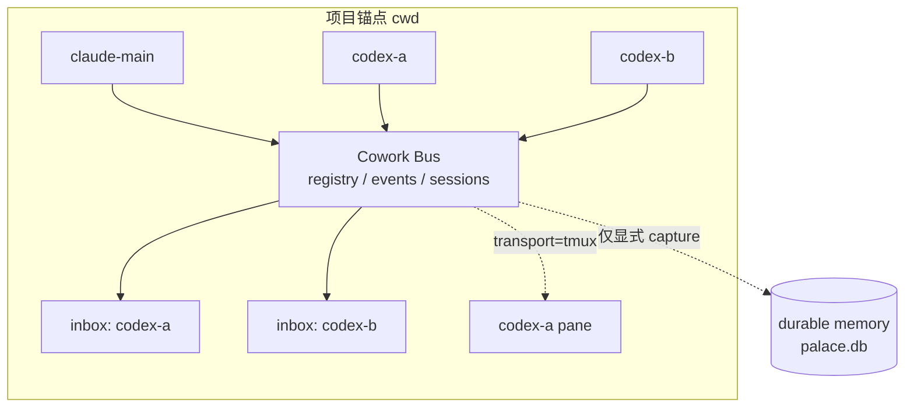

# 第 8 章：多 agent 协作

> **本章定位**：说明 mempal 如何支持同一项目里的 Claude、Codex、tmux pane 等多个 agent 实例通信。

mempal 的协作层解决的是同一项目里多个 agent 的通信问题。

这里的“通信”不是把所有 agent 合并成一个中心化 runtime。每个 agent 仍然独立运行。mempal 提供的是 registry、inbox、events、delivery status、tmux transport、session 和 handoff，让它们能在同一个项目锚点下交换状态。

早期能力是 Claude/Codex pair：

- `mempal_peek_partner`：只读查看 partner 当前 session。
- `mempal_cowork_push`：把短消息投递到 partner inbox，在对方下一次 UserPromptSubmit 时交付。

push 不是实时 UI 注入。它是 at-next-submit。对方不提交下一次 prompt，就不会看到消息。

这条旧路径仍然有用，但它是两方模型。项目里一旦出现一个 Claude Code、两个 Codex、一个 tmux agent，就需要 concrete agent bus。

后来的 concrete cowork bus 支持超过两个 agent。整体拓扑如下：同一项目锚点（`cwd`）下，多个 agent 通过 bus 交换状态，每个 agent 有自己的 inbox，tmux agent 还可以直接投递到 pane；只有显式 capture 才跨过 runtime / durable memory 的边界。



每个 agent 有稳定 `agent_id`：

```bash
mempal cowork-register --cwd "$PWD" --agent-id claude-main --tool claude
mempal cowork-register --cwd "$PWD" --agent-id codex-a --tool codex
mempal cowork-register --cwd "$PWD" --agent-id codex-b --tool codex
```

`agent_id` 是通信地址。不要用“当前谁在线”或“哪个窗口看起来像 Codex”作为地址。显式注册让消息、ack、deliveries、sessions 都能追到具体 actor。

presence 也是显式的：

```bash
mempal cowork-agents --cwd "$PWD"
mempal cowork-heartbeat --cwd "$PWD" --agent-id codex-a
```

没有 heartbeat 不代表 agent 死亡，只代表 mempal 没有近期 presence evidence。这个设计避免 mempal 猜测 runtime 状态。

mempal 故意不自动推断 liveness，是因为两种误判的代价不对称。假阳性（把已退出的 agent 当成在线）会让消息发进一个永远不会被 drain 的 inbox，发送方却以为已送达；假阴性（把还在工作的 agent 判成离线）可能让协作方跳过它、重复领走它正在做的任务。在多 agent 并发场景里，这两种错误都会制造难以排查的协作幻觉。与其用一个必然有误判的探测逻辑去猜，不如只陈述事实——“最近一次 presence 是什么时候”——把是否在线的判断留给掌握更多上下文的调用方。

发送消息：

```bash
mempal cowork-send \
  --cwd "$PWD" \
  --from claude-main \
  --to codex-a \
  --thread-id p105-book \
  --message "请审查第 3 章架构图。"
```

send 写入目标 agent 的 inbox，并记录 event。接收方可以 drain，处理后 ack。message id 使用 delivery event id，这让 pending、drained、acked、failed 状态可回放。

广播或频道：

```bash
mempal cowork-channel-set \
  --cwd "$PWD" \
  --channel review \
  --agent codex-a \
  --agent codex-b

mempal cowork-channel-send \
  --cwd "$PWD" \
  --from claude-main \
  --channel review \
  --message "进入最终 review。"
```

两者的 fanout 范围不同：channel 是显式成员制，只投递给 `channel-set` 加入的 agent，适合 review、docs、ci 这类稳定工作组；broadcast 投递给当前 `cwd` 下所有已注册的 agent，适合一次性全员同步。两者都应带 thread/session 语义，避免多任务并发时消息串线。

delivery 可以 drain、ack、replay：

```bash
mempal cowork-agent-drain --cwd "$PWD" --agent-id codex-a
mempal cowork-deliveries --cwd "$PWD" --agent-id codex-a
mempal cowork-ack --cwd "$PWD" --agent-id codex-a --message-id evt-...
mempal cowork-events --cwd "$PWD" --limit 20
```

`cowork-events` 是 operational event log。它帮助排查消息是否送达、谁注册过、tmux 投递是否失败，但它不是 durable project memory。

tmux-backed agent 需要显式注册 pane：

```bash
mempal cowork-register \
  --cwd "$PWD" \
  --agent-id codex-a \
  --tool codex \
  --transport tmux \
  --tmux-target mempal:0.1
```

tmux transport 的含义是直接向 pane 投递，而不是 fallback 到 inbox。这样可以把一个长期运行的 Codex/Claude session 当作具体接收端。但 transport 失败时应该被记录，而不是静默改走其他路径。

`cowork-tmux-peek` 是 read-only，不写 event、不写 inbox、不写 `palace.db`：

```bash
mempal cowork-tmux-peek --cwd "$PWD" --agent-id codex-a --lines 80
```

peek 用来观察当前 pane 内容，不是 message delivery，也不是 memory capture。

session 用来组织一组 agent 的共同任务：

```bash
mempal cowork-session-create \
  --cwd "$PWD" \
  --session-id p105-book \
  --title "mempal book zh-CN" \
  --agent claude-main \
  --agent codex-a \
  --goal "完成中文书稿。"

mempal cowork-handoff --cwd "$PWD" --session-id p105-book
```

session 解决的是“这组 agent 正在围绕哪个目标协作”。handoff 汇总 session、agents、pending deliveries、recent events，让接手者快速理解当前状态。

runtime 协作默认是 ephemeral。只有显式 capture 才会进入 durable memory：

```bash
mempal cowork-session-close \
  --cwd "$PWD" \
  --session-id p105-book \
  --capture \
  --execute \
  --format json
```

这条边界很重要。协作日志不等于长期记忆。mempal 要避免把所有 runtime 噪声都写进 palace。

## 三方通信的推荐模式

同一个项目里有一个 Claude Code 和两个 Codex 时，推荐做法是：

1. 三个 agent 都 register，使用稳定 `agent_id`。
2. 为当前任务创建 session，并把三个 agent 加入 session。
3. 对点任务用 `cowork-send`，公共同步用 channel 或 broadcast。
4. 接收方 drain 后处理，再 ack。
5. 关键阶段生成 handoff。
6. 只有当 handoff 对未来项目决策有价值时，才 `cowork-capture --execute` 或 session close capture。

这个模式能让多 agent 通信可追踪，但不会把所有聊天噪声变成长期记忆。

## 本章来源

本章依据 P84-P96 multi-agent cowork specs、P101 session close capture、`docs/COWORK-RUNBOOK.md`，以及 `AGENTS.md` 的 MCP cowork tool inventory 整理。
