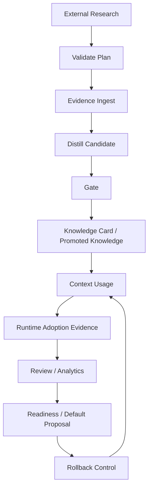

# 第 9 章：自进化闭环

> **本章定位**：说明 mempal 已经完成的自进化基座，以及它为什么不是无监督 autonomous promotion system。

mempal 的自进化不是“agent 自己改自己”。它是一个有证据、有门槛、有回滚的闭环。



这条链路的核心不是自动化程度，而是每一步的 authority 边界。谁可以提供材料，谁可以建议，谁可以写 evidence，谁可以改变 knowledge state，谁可以改变默认 runtime 行为，都必须分清。

## 1. Research 产生 evidence，不产生 dao

第一步是 external research。research-rs 或其他 CLI 可以生成 report，但 report 不能直接定义 dao。mempal 先 validate：

```bash
mempal phase3 research-validate-plan report.json --format json
mempal phase3 research-ingest-plan report.json --format json
mempal phase3 research-ingest-plan report.json --execute --format json
```

写入的是 evidence，或者 evidence-backed candidate insight。

这一步解决的是“外部信息如何进入记忆系统”。外部 research 可以很强，但它仍然不是 authority。它的 report 需要满足 contract，sources 和 findings 要能被验证；即使 report 合法，它也只能进入 evidence 或 distill 建议。真正的 knowledge promotion 仍在 mempal lifecycle 里。

## 2. Distill 产生 candidate，不产生 promoted belief

第二步是 distill。agent 或人类从 evidence refs 中提炼 candidate knowledge。candidate 不是 promoted/canonical belief。它只是“值得治理的知识候选”。

candidate 的价值是把 raw evidence 变成可讨论的命题。它不是“系统已经相信”，而是“系统认为这条命题值得检查”。这个状态让 agent 可以参与学习，但不会让 agent 的一次总结直接污染长期信念。

## 3. Gate 与 lifecycle 控制权

第三步是 gate 和 lifecycle。promotion 要满足 deterministic policy。evaluator 可以 advisory，但不能绕过 gate 和 human review。gate 检查哪些条件、evidence role 如何区分、authority 边界为何这样划，定义见第 6 章 §Gate 与 authority；本章只说明它在闭环里的位置。

promotion 和 demotion 都是 lifecycle action。promotion 需要 supporting/verification evidence、status policy 和必要的人类 review；demotion 需要 evidence-backed reason，其 `reason_type` 取 `contradicted` / `obsolete` / `superseded` / `out_of_scope` / `unsafe` 之一，counterexample 只是其中一类支撑证据，而非唯一形式。Evaluator 可以帮助找风险、建议 refs、解释 readiness，但它不能直接 mutate state。

这个边界对应 P80/P81 的 autonomous promotion audit：mempal 的最终治理边界是 human-gated lifecycle authority。也就是说，系统可以越来越会建议，但不应该静默把建议变成 stable belief。

## 4. Runtime usage 产生 adoption evidence

第四步是 runtime 使用。context 或 card 被 agent 使用后，需要记录 adoption：

```bash
mempal phase3 adoption capture \
  --surface card-context \
  --outcome accepted \
  --query "当前任务" \
  --execute
```

adoption evidence 记录的不是“这个 card 存在”，而是“这个 card/context/evaluator/research result 在实际任务中是否被使用、接受、拒绝、miss 或 rollback”。这使 mempal 能从“知识已经治理”走向“知识是否真的有用”。

P82 的 `adoption wrap` 让一次 child command 可以被显式包裹并记录 adoption，但它仍然是 opt-in instrumentation。mempal 不做 silent background capture。

## 5. Review、readiness、default proposal、rollback

第五步是 review：

```bash
mempal phase3 adoption review --format json
mempal phase3 adoption analytics --format json
mempal phase3 readiness card-context-default --format json
```

如果 evidence 足够，才可以生成 default proposal。proposal 仍然是只读建议，不是直接改默认。真正启用默认值，需要显式 control，并且必须有 rollback criteria。

这一步是自进化与普通“自动调参”的分界线。mempal 不会因为出现几条 accepted signal 就立刻改变默认行为。它先做 readiness，确认 evidence 是否足够、是否有 rollback signal；再生成 default proposal；最后由显式 control 执行默认值变更，并保留 rollback-control 路径。

以 card context default-on 为例：P46 先声明默认仍 opt-in；P56 增加 read-only gate；P74 生成 proposal；P78 引入 runtime flag；P79 提供 rollback executor policy。这个顺序说明 mempal 不是不做默认开启，而是不在没有证据和回滚机制前默认开启。

哪些可以自动？

| 步骤 | 自动程度 |
|---|---|
| validate report | 自动检查 |
| ingest evidence | 需要 `--execute` |
| distill candidate | 可由 agent 建议，需要 evidence refs |
| gate | 自动评估 |
| promote/demote | 需要显式调用和证据 |
| adoption capture | 需要显式或 wrapper |
| analytics/readiness | 自动汇总 |
| default enable/rollback | 需要显式控制 |

更准确地说，mempal 自动化的是低风险计算：validate、plan、gate、review、analytics、readiness。需要改变持久状态或默认 runtime 行为的动作，都要求显式调用，通常还要求 evidence refs 或 rollback criteria。

因此 mempal 当前完成的是 governed self-evolution substrate。它已经能跑闭环，但不是无监督 autonomous promotion system。

这是有意为之。自进化系统最危险的不是不会进化，而是错误进化后无法解释、无法回滚。mempal 选择先把证据链和控制面做好。

## 当前完成度

按当前实现，mempal 已经具备完整的自进化基座：

- research report contract validation 和 research ingest plan。
- evidence ingestion 和 candidate distill。
- Stage-1 knowledge lifecycle 与 Phase-2 knowledge card lifecycle。
- evaluator advisory API。
- context/card runtime 使用面。
- runtime adoption events、capture、checked record、review、analytics。
- readiness、default proposal、default control、rollback control。
- P71 replay 证明 research -> evidence -> card promotion -> context -> checked adoption 可以闭环。

这里的“证明”不是叙述，而是一个可复跑的 CLI E2E 测试 `tests/phase3_self_evolution_replay.rs`。它用真实 `mempal` binary 顺序跑完 research validate/ingest、distill、gate、card promote、context、adoption capture，并断言每一步的产物。你可以自己复现：

```bash
cargo test --test phase3_self_evolution_replay
```

测试还包含一条反向用例（invalid research 不产生任何 artifact），用来确认非法输入不会偷偷写入状态。换句话说，闭环“能跑”和“拒绝越界”这两件事都有可执行的回归保证，而不是只写在书里。

它还没有宣称“完全自治”。未做的不是基础闭环，而是更高权限的自动 runtime actor：例如自动发现任务、自动执行 maintenance、自动 promotion、自动 default-on。这些如果未来要做，也必须先产生 spec、evidence、rollback 和 human review 边界。

## 本章来源

本章依据 P49-P50 research/evaluator policy、P54-P82 Phase-3/self-evolution specs、P71 replay、P80/P81 autonomous promotion boundary，以及 `docs/MAINTENANCE-RUNBOOK.md` 整理。
