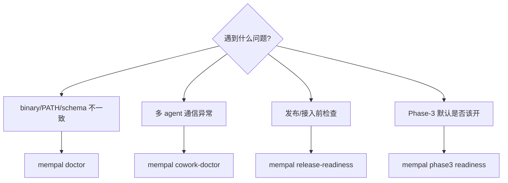

# 第 10 章：安装、诊断与实际工作流

> **本章定位**：给出当前 mempal 新版本的实际使用路径，重点是诊断、日常任务、维护和多 agent 收尾。

真实使用前，先安装当前版本：

```bash
cargo install --path . --locked --force
which mempal
mempal doctor --format json
```

如果是发布版本，可用 `cargo install mempal`；如果是在本仓库开发和验证当前实现，使用 `cargo install --path . --locked --force` 更直接。安装后必须确认 `PATH` 解析到的 binary 是刚安装的版本。

`doctor` 是 P98 引入的只读诊断。它会报告：

- 当前 binary version。
- supported schema version。
- `palace.db` 路径和 schema。
- 当前进程 executable。
- `PATH` 中解析到的 `mempal`。
- warnings 和 recommendations。

最常见问题是旧 binary 对新 schema。比如数据库已经是 schema v9，但 `PATH` 里还是只支持旧 schema 的 `mempal`。这时 agent 的 MCP server 可能启动失败，或者缺少新工具。解决方式是重新安装并重启长生命周期客户端。

mempal 有几个 read-only 诊断命令，分别面向不同问题。按下图选用：



## MCP 启动和重启

MCP 启动：

```bash
mempal serve --mcp
```

Claude Code、Codex 等客户端需要在升级后重启，让 MCP server 重新 spawn。仅仅安装新 binary，不会自动更新已经运行中的 MCP server。

这类问题的表现通常是：CLI 已经有新命令，但 MCP tool list 没有新 action；或者 schema v9 已经存在，但 MCP runtime 使用旧 binary 报不兼容。优先用 `mempal doctor --format json` 和 `mempal_doctor` 对照 CLI/MCP 看到的能力。

## 发布和接入前检查

发布/接入前跑：

```bash
mempal release-readiness --format json
```

它检查 Cargo metadata、README、P98-P104 spec/plan、runbook、doctor、schema support。它不发布、不联网、不运行 `cargo package`，只给出 readiness。

`release-readiness` 的意义不是替代 CI，而是把发布前容易漏掉的工程面集中检查：README 是否提到关键安装路径，spec/plan 是否齐全，runbook 是否存在，doctor 是否能解释 schema。它是 read-only checklist。

## 日常任务流程

日常任务推荐流程：

```bash
mempal doctor --format json
mempal context "当前任务" --include-cards --format plain
mempal brief "当前任务" --format json
mempal search "历史决策关键词" --wing mempal
```

解释一下这四步。

第一步 `doctor` 确认工具和数据库状态。如果当前 binary 与 schema 不匹配，后面所有 agent runtime 行为都不可信。

第二步 `context` 获取操作性 guidance。对实现类任务，context 可以告诉 agent 当前项目的 dao/shu/qi、anchor-specific 约束和 card-aware guidance。

第三步 `brief` 生成 citation-first 简报。它适合在任务开始前建立态势，尤其是历史复杂、证据分散时。

第四步 `search` 查具体历史证据。当问题是“为什么这样做”“哪个 spec 定义了这个边界”“哪个 PR 合并了这个能力”时，search 是主入口。

任务结束后，如果 context 或 card 真的帮助了 agent，记录 adoption：

```bash
mempal phase3 adoption capture \
  --surface card-context \
  --outcome accepted \
  --query "当前任务" \
  --execute
```

如果记录质量需要预检查，可以先用 `prepare-record` 或 `check-record`，再用 `record-checked`。原则是：adoption evidence 应该描述实际使用结果，不应该把“看过”伪装成“有效”。

## 维护流程

维护时用 guided run：

```bash
mempal maintenance guided-run --format plain
```

它不会执行命令，只输出下一步清单：research validate、research ingest、knowledge distill、card gate、context review、adoption review、rollback review、cowork doctor、handoff、capture。

完整维护 loop 可以按 `docs/MAINTENANCE-RUNBOOK.md` 执行：

```bash
mempal phase3 research-validate-plan report.json --format json
mempal phase3 research-ingest-plan report.json --format json
mempal phase3 research-ingest-plan report.json --execute --format json
mempal knowledge-card gate card_...
mempal context "current task" --include-cards
mempal phase3 adoption review --format json
mempal phase3 rollback-control card-context --format json
```

注意：guided-run 和 runbook 都是指导，不是 daemon。它们不会替你静默执行 ingestion、promotion 或 default control。

## 多 agent 收尾

多 agent 工作时：

```bash
mempal cowork-doctor --cwd "$PWD"
mempal cowork-handoff --cwd "$PWD" --format plain
mempal cowork-session-close --cwd "$PWD" --session-id p105 --capture --execute --format json
```

`cowork-doctor` 检查 registry、presence、pending deliveries、channels、sessions 和可选 tmux probe。`cowork-handoff` 汇总当前协作状态。`cowork-session-close --capture --execute` 把 session 收尾和 durable evidence capture 合并成显式动作。

如果只是临时聊天，不要 capture。如果 handoff 包含架构决策、重要失败、可复用经验或需要未来 agent 继承的状态，就应该 capture。

## 常见踩坑

以下几条来自真实 E2E，大多是跨系统约束（与 mempal 代码无关，但会直接影响使用体验），值得在接入前先知道。

第一，**hooks 是两件制品，缺一不 fire**。`mempal cowork-install-hooks` 会写两样东西：`.claude/hooks/user-prompt-submit.sh`（脚本）和 `.claude/settings.json` 里的 `hooks.UserPromptSubmit` 注册条目。Claude Code 不按文件名约定自动发现脚本，两件都必须在 hook 才会触发。`install-hooks` 已自动处理并自愈 stale 条目，不要手工移除其中任一件。

第二，**Codex 侧依赖 `codex_hooks` feature flag**。shipped 的 `codex-cli`（≤ 0.120.0）该 flag 默认 `false`，此时 Codex runtime 完全忽略 `~/.codex/hooks.json`。`install-hooks` 检测到会打印 warning 和激活命令 `codex features enable codex_hooks`。

第三，**Codex TUI 启动时一次性缓存 config**。改完 `config.toml` 或 `hooks.json`（含 feature flag、install-hooks）后，必须完全退出并重启 Codex TUI；已在运行的进程拿不到新配置。

第四，**`mempal_cowork_push` 依赖 MCP `ClientInfo.name` 被识别为 Claude/Codex 家族之一**。caller_tool 推断基于客户端上报的名字，当前识别名单覆盖 `claude` / `claude-code` / `codex` / `codex-cli` / `codex-tui` / `codex-mcp-client` 等。名字不在列表的 MCP 客户端，即使显式传 `target_tool` 也会被拒；这不是 by-design scope 限制，遇到新家族继续扩名单即可。

（升级 binary 后 MCP server 仍是旧进程、不认识新工具这一条，见上文 §MCP 启动和重启。）

## 实际习惯

使用 mempal 的核心习惯是：开始前取 context，决策时查 evidence，结束时记录 adoption 或 capture。这样项目记忆才会从“能搜到”变成“能复利”。

更具体地说：

| 时间点 | 建议动作 | 目的 |
|---|---|---|
| 安装/升级后 | `mempal doctor`、重启 MCP 客户端 | 确认 runtime 能力一致 |
| 新任务开始 | `mempal context`、`mempal brief` | 建立操作上下文 |
| 讨论历史决策 | `mempal search` | 找证据和引用 |
| 形成新知识候选 | `knowledge distill`、`knowledge-card link` | 从 evidence 进入治理流程 |
| 任务结束 | adoption capture 或 cowork capture | 写回 runtime 反馈 |
| 阶段维护 | guided-run、review、analytics、readiness | 判断是否调整默认行为 |

如果只使用 search，mempal 只是一个更好的历史查找工具。只有把 context、knowledge lifecycle、adoption evidence 和 cowork capture 放进日常流程，它才会成为真正的项目记忆层。

## 本章来源

本章依据 P98-P104 ops runtime specs、`docs/MAINTENANCE-RUNBOOK.md`、`docs/COWORK-RUNBOOK.md`、`AGENTS.md` MCP/CLI inventory，以及 P82 opt-in instrumentation wrapper 整理。
